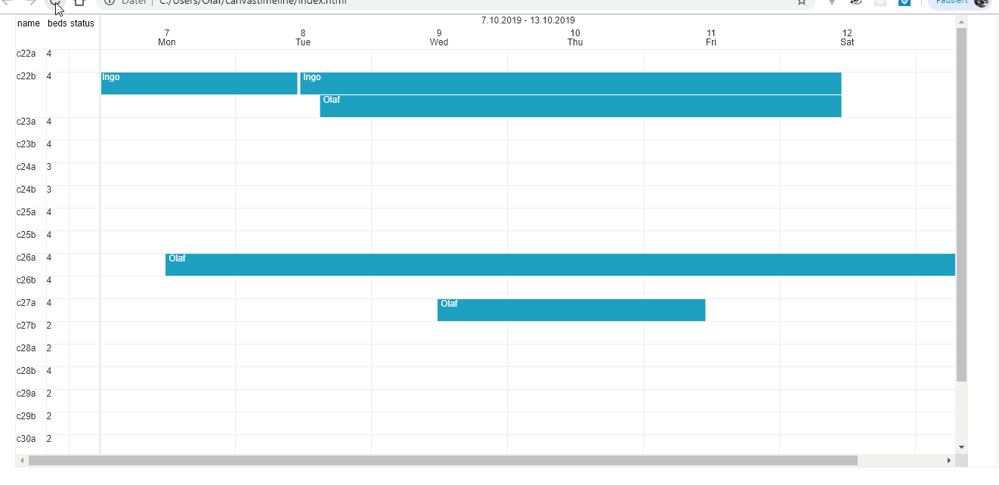

# canvastimeline
This project aims to see if canvas is a viable option for a scheduler / timeline widget versus "normal" DOM elements.

In canvas' immediate mode almost everything needs to be scheduled in the right order and calculated on a much lower level then when relying on the DOM.

It has advantages though, too and even in DOM based scheduler libraries part of the layout is usually absolutely positioned and pre/-recalculated to make perfect sense.  
Thus, the effort to build a fully fledged "thing" with canvas in the end might not be much different, but maybe will keep restricted to a certain amount of features. 

One thing I will probably not add directly to the calendar class is buttons and controls, this should keep completely flexible and the class will provide the functions you can call whenever someone uses your user interface surrounding instances of this canvastimeline.

# What it does
+ show a flexible amount of "resources" in the left column, which is sticky.
+ within the resources you can have a flexible amount of headers which have a name and a width
+ the resource header names should match the object attributes in the resources you load (see code just via an array of objects) thus each row is filled with the approprate data
+ the calendar of course adapts the number of days, day names etc. when switching between months or weeks
+ currently year, month and week views with daily segmentation as well as week and day with hourly and half-day segments are available and switching between them (you have to load events again)
+ it recalculates "everything" to match a chosen cell height and cell width.
+ the header row with the dates is also sticky
+ you can load any amount of events which will be visible when they are matching the currently chosen month
+ you can add and remove single events, the geometry will be adjusted
+ events now have an optional color and background attribute
+ the events have the appropriate relative width and position according to their start and end date
+ the events will be packed to some extend but never overlap, so the cell heights keep at a minimum but events are always visible
+ changing a month empties the events which are at the moment internally attached to resources
+ a configurable click handler (deliver your callback with initial config object) is attached to the event layer canvas and finds the event clicked (or no event when the click was not where an event is)
+ configure "internationalize" day names and month names
+ overwrite method to get text from your events with init config object
+ add and delete resources (this happens without deleting the currently loaded events)
+ swap resources for others

# Limits of Canvas
One of the limits is (depending on the browser) the size constraints of canvases. So there is no unlimited amount of resources, events and cellWidth or cellHeight possible if not complicating things by showing and redrawing only a chunk of the resources and/or timerange or by combining more canvases in a mosaic fashion.
Reasonable limits right now with the easy solution to have the whole picture painted each time and thus smooth scrolling without headaches are for example for a year view cell width 30 (px), for a month view 60-180 (px) and for a week view more but probably never really necessary.
For number of resources - if you stay below 200 (with few overlapping events) with a cell height of 30 (px) you should be fine in most browsers, if you want to limit the cellHeight to 15px (if you do not need 2 lines of text that's reasonable for example) then you can double the amount of resources possible.

# Performance - just very quick and dirty
Placing performance.now() on my laptop which should be some mid-range equipment (i7 5500 dual core, NVDIA Geforce 920M) for example comes back after 18 - 20ms (Chrome) and about 76ms (Firefox) for the app.js example last loadAndDrawEvents call with 700 (many overlapping) events in the year view.
This is probably good enough for most business apps, seems like canvas is a good option for small to medium amount of resource columns and no extra-wide/high cells. The browser memory after that app.js run is at something around 50MB in Chrome.
See below though if you need ALL browsers displaying everything perfectly some work needs to be done to get rid of weird behaviors in some browsers (like always?)

# Compatibility
I tested this in Chrome, Firefox and Edge on Windows, due to the use of class syntactic sugar instead of direct use of function and prototype plus position sticky this does not work in our friend IE.

 
